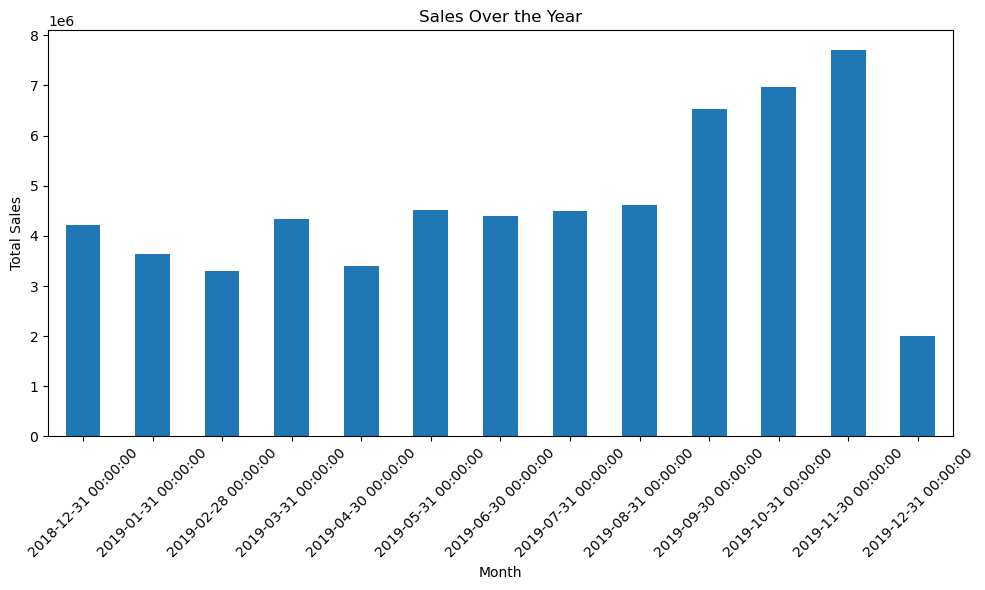

## Content

This is a sales transaction data set of UK-based e-commerce (online retail) for one year. This London-based shop has been selling gifts and homewares for adults and children through the website since 2007. Their customers come from all over the world and usually make direct purchases for themselves. There are also small businesses that buy in bulk and sell to other customers through retail outlet channels.

The data set contains over 500K rows and 8 columns. The following is the description of each column.

 - TransactionNo (categorical): a six-digit unique number that defines each transaction. The letter “C” in the code indicates a cancellation.
 - Date (numeric): the date when each transaction was generated.
 - ProductNo (categorical): a five or six-digit unique character used to identify a specific product.
 - Product (categorical): product/item name.
 - Price (numeric): the price of each product per unit in pound sterling (£).
 - Quantity (numeric): the quantity of each product per transaction. Negative values related to cancelled transactions.
 - CustomerNo (categorical): a five-digit unique number that defines each customer.
 - Country (categorical): name of the country where the customer resides.

There is a small percentage of order cancellation in the data set. Most of these cancellations were due to out-of-stock conditions on some products. Under this situation, customers tend to cancel an order as they want all products delivered all at once.

### Inspiration
Information is a main asset of businesses nowadays. The success of a business in a competitive environment depends on its ability to acquire, store, and utilize information. Data is one of the main sources of information. Therefore, data analysis is an important activity for acquiring new and useful information. Analyze this dataset and try to answer the following questions.

 - How was the sales trend over the months?
 - What are the most frequently purchased products?
 - How many products does the customer purchase in each transaction?
 - What are the most profitable segment customers?
   
Based on your findings, what strategy could you recommend to the business to gain more profit?


```python
import pandas as pd
import numpy as np
import matplotlib.pyplot as plt
```


```python
data = pd.read_csv(r"C:\Users\User\Sales Transaction.csv")
```

## Cleaning


```python
#data overview
data.head(5)
```


<div>
<style scoped>
    .dataframe tbody tr th:only-of-type {
        vertical-align: middle;
    }

    .dataframe tbody tr th {
        vertical-align: top;
    }

    .dataframe thead th {
        text-align: right;
    }
</style>
<table border="1" class="dataframe">
  <thead>
    <tr style="text-align: right;">
      <th></th>
      <th>TransactionNo</th>
      <th>Date</th>
      <th>ProductNo</th>
      <th>ProductName</th>
      <th>Price</th>
      <th>Quantity</th>
      <th>CustomerNo</th>
      <th>Country</th>
    </tr>
  </thead>
  <tbody>
    <tr>
      <th>0</th>
      <td>581482</td>
      <td>12/9/2019</td>
      <td>22485</td>
      <td>Set Of 2 Wooden Market Crates</td>
      <td>21.47</td>
      <td>12</td>
      <td>17490.0</td>
      <td>United Kingdom</td>
    </tr>
    <tr>
      <th>1</th>
      <td>581475</td>
      <td>12/9/2019</td>
      <td>22596</td>
      <td>Christmas Star Wish List Chalkboard</td>
      <td>10.65</td>
      <td>36</td>
      <td>13069.0</td>
      <td>United Kingdom</td>
    </tr>
    <tr>
      <th>2</th>
      <td>581475</td>
      <td>12/9/2019</td>
      <td>23235</td>
      <td>Storage Tin Vintage Leaf</td>
      <td>11.53</td>
      <td>12</td>
      <td>13069.0</td>
      <td>United Kingdom</td>
    </tr>
    <tr>
      <th>3</th>
      <td>581475</td>
      <td>12/9/2019</td>
      <td>23272</td>
      <td>Tree T-Light Holder Willie Winkie</td>
      <td>10.65</td>
      <td>12</td>
      <td>13069.0</td>
      <td>United Kingdom</td>
    </tr>
    <tr>
      <th>4</th>
      <td>581475</td>
      <td>12/9/2019</td>
      <td>23239</td>
      <td>Set Of 4 Knick Knack Tins Poppies</td>
      <td>11.94</td>
      <td>6</td>
      <td>13069.0</td>
      <td>United Kingdom</td>
    </tr>
  </tbody>
</table>
</div>


```python
data.shape
```


    (536350, 8)


```python
data.duplicated().sum()
```


    5200


```python
data[data.duplicated()]
```


<div>
<style scoped>
    .dataframe tbody tr th:only-of-type {
        vertical-align: middle;
    }

    .dataframe tbody tr th {
        vertical-align: top;
    }

    .dataframe thead th {
        text-align: right;
    }
</style>
<table border="1" class="dataframe">
  <thead>
    <tr style="text-align: right;">
      <th></th>
      <th>TransactionNo</th>
      <th>Date</th>
      <th>ProductNo</th>
      <th>ProductName</th>
      <th>Price</th>
      <th>Quantity</th>
      <th>CustomerNo</th>
      <th>Country</th>
    </tr>
  </thead>
  <tbody>
    <tr>
      <th>985</th>
      <td>581497</td>
      <td>12/9/2019</td>
      <td>21481</td>
      <td>Fawn Blue Hot Water Bottle</td>
      <td>7.24</td>
      <td>1</td>
      <td>17497.0</td>
      <td>United Kingdom</td>
    </tr>
    <tr>
      <th>1365</th>
      <td>581538</td>
      <td>12/9/2019</td>
      <td>23275</td>
      <td>Set Of 3 Hanging Owls Ollie Beak</td>
      <td>6.19</td>
      <td>1</td>
      <td>14446.0</td>
      <td>United Kingdom</td>
    </tr>
    <tr>
      <th>1401</th>
      <td>581538</td>
      <td>12/9/2019</td>
      <td>22992</td>
      <td>Revolver Wooden Ruler</td>
      <td>6.19</td>
      <td>1</td>
      <td>14446.0</td>
      <td>United Kingdom</td>
    </tr>
    <tr>
      <th>1406</th>
      <td>581538</td>
      <td>12/9/2019</td>
      <td>22694</td>
      <td>Wicker Star</td>
      <td>6.19</td>
      <td>1</td>
      <td>14446.0</td>
      <td>United Kingdom</td>
    </tr>
    <tr>
      <th>1409</th>
      <td>581538</td>
      <td>12/9/2019</td>
      <td>23343</td>
      <td>Jumbo Bag Vintage Christmas</td>
      <td>6.19</td>
      <td>1</td>
      <td>14446.0</td>
      <td>United Kingdom</td>
    </tr>
    <tr>
      <th>...</th>
      <td>...</td>
      <td>...</td>
      <td>...</td>
      <td>...</td>
      <td>...</td>
      <td>...</td>
      <td>...</td>
      <td>...</td>
    </tr>
    <tr>
      <th>535227</th>
      <td>536559</td>
      <td>12/1/2018</td>
      <td>51014L</td>
      <td>Feather Pen Light Pink</td>
      <td>11.12</td>
      <td>12</td>
      <td>17873.0</td>
      <td>United Kingdom</td>
    </tr>
    <tr>
      <th>535310</th>
      <td>536569</td>
      <td>12/1/2018</td>
      <td>22111</td>
      <td>Scottie Dog Hot Water Bottle</td>
      <td>15.32</td>
      <td>1</td>
      <td>16274.0</td>
      <td>United Kingdom</td>
    </tr>
    <tr>
      <th>535327</th>
      <td>536569</td>
      <td>12/1/2018</td>
      <td>21809</td>
      <td>Christmas Hanging Tree With Bell</td>
      <td>11.53</td>
      <td>1</td>
      <td>16274.0</td>
      <td>United Kingdom</td>
    </tr>
    <tr>
      <th>535960</th>
      <td>536592</td>
      <td>12/1/2018</td>
      <td>82613A</td>
      <td>Metal Sign Cupcake Single Hook</td>
      <td>12.82</td>
      <td>1</td>
      <td>16592.0</td>
      <td>United Kingdom</td>
    </tr>
    <tr>
      <th>536190</th>
      <td>536528</td>
      <td>12/1/2018</td>
      <td>22839</td>
      <td>3 Tier Cake Tin Green And Cream</td>
      <td>25.57</td>
      <td>1</td>
      <td>15525.0</td>
      <td>United Kingdom</td>
    </tr>
  </tbody>
</table>
<p>5200 rows × 8 columns</p>
</div>


```python
#drop duplicates
df = data.drop_duplicates()
```


```python
df.shape
```


    (531150, 8)


```python
df.columns
```


    Index(['TransactionNo', 'Date', 'ProductNo', 'ProductName', 'Price',
           'Quantity', 'CustomerNo', 'Country'],
          dtype='object')


```python
df.isnull().sum()
```


    TransactionNo     0
    Date              0
    ProductNo         0
    ProductName       0
    Price             0
    Quantity          0
    CustomerNo       55
    Country           0
    dtype: int64


```python
#identifying rows with missing values
missing = df[df.isnull().any(axis=1)].count()
```


```python
#Rows with missing data
df1 = df.dropna(axis=0)
```


```python
#check data description
df1.dtypes
```


    TransactionNo     object
    Date              object
    ProductNo         object
    ProductName       object
    Price            float64
    Quantity           int64
    CustomerNo       float64
    Country           object
    dtype: object


```python
#convert CustomerNo column to String
df1.loc[:, 'CustomerNo'] = df1['CustomerNo'].astype(str)
df1.dtypes
```


    TransactionNo     object
    Date              object
    ProductNo         object
    ProductName       object
    Price            float64
    Quantity           int64
    CustomerNo        object
    Country           object
    dtype: object


```python
#convert Date column to date-time
df1['Date'] = pd.to_datetime(df1['Date'])
df1.dtypes
```

    C:\Users\User\AppData\Local\Temp\ipykernel_18800\3182607419.py:2: SettingWithCopyWarning: 
    A value is trying to be set on a copy of a slice from a DataFrame.
    Try using .loc[row_indexer,col_indexer] = value instead
    
    See the caveats in the documentation: https://pandas.pydata.org/pandas-docs/stable/user_guide/indexing.html#returning-a-view-versus-a-copy
      df1['Date'] = pd.to_datetime(df1['Date'])
    


    TransactionNo            object
    Date             datetime64[ns]
    ProductNo                object
    ProductName              object
    Price                   float64
    Quantity                  int64
    CustomerNo               object
    Country                  object
    dtype: object


```python
df1.info()
```

    <class 'pandas.core.frame.DataFrame'>
    Index: 531095 entries, 0 to 536349
    Data columns (total 8 columns):
     #   Column         Non-Null Count   Dtype         
    ---  ------         --------------   -----         
     0   TransactionNo  531095 non-null  object        
     1   Date           531095 non-null  datetime64[ns]
     2   ProductNo      531095 non-null  object        
     3   ProductName    531095 non-null  object        
     4   Price          531095 non-null  float64       
     5   Quantity       531095 non-null  int64         
     6   CustomerNo     531095 non-null  object        
     7   Country        531095 non-null  object        
    dtypes: datetime64[ns](1), float64(1), int64(1), object(5)
    memory usage: 36.5+ MB
    


```python
data.info()
```

    <class 'pandas.core.frame.DataFrame'>
    RangeIndex: 536350 entries, 0 to 536349
    Data columns (total 8 columns):
     #   Column         Non-Null Count   Dtype  
    ---  ------         --------------   -----  
     0   TransactionNo  536350 non-null  object 
     1   Date           536350 non-null  object 
     2   ProductNo      536350 non-null  object 
     3   ProductName    536350 non-null  object 
     4   Price          536350 non-null  float64
     5   Quantity       536350 non-null  int64  
     6   CustomerNo     536295 non-null  float64
     7   Country        536350 non-null  object 
    dtypes: float64(2), int64(1), object(5)
    memory usage: 32.7+ MB
    

## Analysis

Questions:
 - How was the sales trend over the months?
 - What are the most frequently purchased products?
 - How many products does the customer purchase in each transaction?
 - What are the most profitable segment customers?


```python
df1.dtypes
```


    TransactionNo            object
    Date             datetime64[ns]
    ProductNo                object
    ProductName              object
    Price                   float64
    Quantity                  int64
    CustomerNo               object
    Country                  object
    dtype: object


```python
# Assuming 'datetime' column is already in datetime format, if not, convert it using pd.to_datetime()

# Calculate total sales by multiplying price and quantity
df1['total_sales'] = df1['Price'] * df1['Quantity']

# Group by datetime and sum the total sales for each datetime
sales_by_date = df1.groupby(pd.Grouper(key='Date', freq='M'))['total_sales'].sum()


# Plotting the sales over the year
plt.figure(figsize=(10, 6))
sales_by_date.plot(kind='bar')
plt.title('Sales Over the Year')
plt.xlabel('Month')
plt.ylabel('Total Sales')
plt.xticks(rotation=45)  # Rotating x-axis labels for better readability
plt.tight_layout()
plt.show()
```

    C:\Users\User\AppData\Local\Temp\ipykernel_18800\586227401.py:4: SettingWithCopyWarning: 
    A value is trying to be set on a copy of a slice from a DataFrame.
    Try using .loc[row_indexer,col_indexer] = value instead
    
    See the caveats in the documentation: https://pandas.pydata.org/pandas-docs/stable/user_guide/indexing.html#returning-a-view-versus-a-copy
      df1['total_sales'] = df1['Price'] * df1['Quantity']
    


    

    


The bar graph indicates that total sales didn't fluctuate greatly over the course of the year with minor dips below average for the months of January and February. These dips can be accounted for as being a time when people tend to recuperate after the December period, as well as adjust to the new year's financial constraints and resolutions. Additionally, there is a noticeable increase in the months of September, October, and November, possibly due to seasonal factors or promotional events. Interestingly, there is a significant drop in total sales in the month of December, falling below the monthly average, which could be attributed to reduced spending after the holiday season or other year-end factors.


```python
#What are the most frequently purchased products?
# Count occurrences of each product
product_counts = df1['ProductName'].value_counts()

# Get the product with the highest count
most_frequent_product = product_counts.idxmax()

#number of units purchased
print(product_counts)

print("The most frequently purchased product is:", most_frequent_product)
```

    ProductName
    Cream Hanging Heart T-Light Holder    2366
    Regency Cakestand 3 Tier              2190
    Jumbo Bag Red Retrospot               2156
    Party Bunting                         1720
    Lunch Bag Red Retrospot               1626
                                          ... 
    Capiz Chandelier                         1
    Cat With Sunglasses Blank Card           1
    Sweetheart Key Cabinet                   1
    Ocean Stripe Hammock                     1
    Porcelain Hanging Bell Small             1
    Name: count, Length: 3767, dtype: int64
    The most frequently purchased product is: Cream Hanging Heart T-Light Holder
    


```python
# Assuming you have the product name stored in a variable called 'product_name'
product_name = "Cream Hanging Heart T-Light Holder"

# Filter the DataFrame for the given product name
product_row = df1[df1['ProductName'] == product_name]

# If the product name is unique and exists in the DataFrame, retrieve its price
if not product_row.empty:
    product_price = product_row['Price'].iloc[0]
    print(f"The price of {product_name} is: {product_price}")
else:
    print(f"No price found for {product_name}")
```

    The price of Cream Hanging Heart T-Light Holder is: 6.19
    


```python
# Group by product name and sum the total sales for each product
product_sales = df1.groupby('ProductName')['total_sales'].sum()

# Find the product with the highest total sales
most_profitable_product = product_sales.idxmax()
total_sales_most_profitable = product_sales.max()

print(f"The most profitable product is '{most_profitable_product}' with total sales of ${total_sales_most_profitable:.2f}")
```

    The most profitable product is 'Popcorn Holder' with total sales of $583075.23
    


```python
# Group by month and sum the total sales for each month
monthly_sales = df1.groupby(df1['Date'].dt.to_period('M'))['total_sales'].sum()

# Calculate the average total sales for the year
average_total_sales = monthly_sales.mean()

print(monthly_sales)
print("monthly average", average_total_sales)
```

    Date
    2018-12    4217281.53
    2019-01    3638948.12
    2019-02    3292324.69
    2019-03    4340035.60
    2019-04    3406002.17
    2019-05    4521986.96
    2019-06    4404297.96
    2019-07    4501972.15
    2019-08    4609655.77
    2019-09    6529427.35
    2019-10    6965035.30
    2019-11    7712905.93
    2019-12    1994715.74
    Freq: M, Name: total_sales, dtype: float64
    monthly average 4625737.636153846
    


```python
# Count the number of months with total sales above the average
months_above_average = (monthly_sales > average_total_sales).sum()

print("months above average", months_above_average)
```

    months above average 3
    

Insights:

 - The product of frequently sold is Cream Hanging Heart T-Light Holder at (\$6.19)
 - The product that brought in the most by total sales is Popcorn Holder with total sales (\$583,075.23)
 - The average month of Total sales (\$4,625,737.64)
 - 3 month exceeding this September ($6,529,427.35),  October(\$6965035.30) and November(\$7712905.93)
   


```python
#How many customers are there
df1["CustomerNo"].nunique()
```


    4738


```python
#customers sorted by total_sales
# Filter out rows with total sales greater than or equal to zero
#df_positive_sales = df1['total_sales']

# Group by customer number and sum the total sales for each customer
customer_sales = df1.groupby('CustomerNo')['total_sales'].sum()

# Sort customers by total sales in descending order
sorted_customers = customer_sales.sort_values(ascending=False)

print("Customers sorted by total sales (excluding negative sales):")
print(sorted_customers)

```

    Customers sorted by total sales (excluding negative sales):
    CustomerNo
    14646.0    2108959.95
    18102.0     897137.36
    12415.0     895267.24
    17450.0     876447.01
    14911.0     872608.57
                  ...    
    17548.0      -1498.20
    17307.0      -1632.96
    16742.0      -1714.91
    16252.0      -1921.72
    14213.0      -3722.46
    Name: total_sales, Length: 4738, dtype: float64
    


```python
#customers sorted by total_sales
# Filter out rows with total sales greater than or equal to zero
df_negative_sales = df1[df1['total_sales']<=0]

# Group by customer number and sum the total sales for each customer
customer_sales = df_negative_sales.groupby('CustomerNo')['total_sales'].sum()

# Sort customers by total sales in descending order
sorted_customers = customer_sales.sort_values(ascending=False)

print("Customers sorted by total sales (excluding negative sales):")
print(sorted_customers)

```

    Customers sorted by total sales (excluding negative sales):
    CustomerNo
    15719.0        -5.97
    14869.0        -6.04
    12375.0        -6.04
    14477.0        -6.04
    15117.0        -6.13
                 ...    
    16029.0    -73640.44
    15838.0    -96220.80
    15749.0   -115955.30
    16446.0   -501359.05
    12346.0   -840113.80
    Name: total_sales, Length: 1533, dtype: float64
    


```python
#Negative total sales 
4738 - 4718 
```


    20


```python
#identify customers with negative total sales
# Filter out rows with negative total sales
negative_sales_customers = df1[df1['total_sales'] < 0]

# Extract the unique CustomerNo with negative total sales
negative_sales_customer_numbers = negative_sales_customers['CustomerNo'].unique()

# Create an empty list to store identified customers
identified_customers = []

# Append each identified customer to the list
for customer_number in negative_sales_customer_numbers:
    identified_customers.append(customer_number)

print("Identified customers with negative total sales:")
print(len(identified_customers))
```

    Identified customers with negative total sales:
    1533
    


```python
#the total of all negative total_sales
# Filter out rows with negative total sales
negative_sales = df1[df1['total_sales'] < 0]

# Calculate the sum of negative total sales
sum_negative_sales = negative_sales['total_sales'].sum()

print("Sum of negative total sales:", sum_negative_sales)
```

    Sum of negative total sales: -2646715.2700000005
    

There is a total of -2,646,715.27 spread out amoungest 1533 customers of 4738 total customers


```python
df1.columns
```


    Index(['TransactionNo', 'Date', 'ProductNo', 'ProductName', 'Price',
           'Quantity', 'CustomerNo', 'Country', 'total_sales'],
          dtype='object')


```python
# Group by CustomerNo and TransactionID and count the number of unique products
products_per_transaction = df1.groupby(['CustomerNo', 'TransactionNo'])['ProductName'].nunique()

# Sort the result in descending order
products_per_transaction_desc = products_per_transaction.sort_values(ascending=False)

print("Number of products purchased per transaction:")
print(products_per_transaction_desc)
```

    Number of products purchased per transaction:
    CustomerNo  TransactionNo
    14585.0     573585           1104
    16219.0     581219            746
    15492.0     581492            730
    16729.0     580729            719
    15475.0     558475            702
                                 ... 
    14796.0     C538530             1
    17450.0     567453              1
    14796.0     C537677             1
    14794.0     C576363             1
    15140.0     C555269             1
    Name: ProductName, Length: 23168, dtype: int64
    


```python
product = df1[df1["TransactionNo"]=="573585"]
product
```


<div>
<style scoped>
    .dataframe tbody tr th:only-of-type {
        vertical-align: middle;
    }

    .dataframe tbody tr th {
        vertical-align: top;
    }

    .dataframe thead th {
        text-align: right;
    }
</style>
<table border="1" class="dataframe">
  <thead>
    <tr style="text-align: right;">
      <th></th>
      <th>TransactionNo</th>
      <th>Date</th>
      <th>ProductNo</th>
      <th>ProductName</th>
      <th>Price</th>
      <th>Quantity</th>
      <th>CustomerNo</th>
      <th>Country</th>
      <th>total_sales</th>
    </tr>
  </thead>
  <tbody>
    <tr>
      <th>109414</th>
      <td>573585</td>
      <td>2019-10-31</td>
      <td>21258</td>
      <td>Victorian Sewing Box Large</td>
      <td>35.83</td>
      <td>2</td>
      <td>14585.0</td>
      <td>United Kingdom</td>
      <td>71.66</td>
    </tr>
    <tr>
      <th>109415</th>
      <td>573585</td>
      <td>2019-10-31</td>
      <td>22282</td>
      <td>12 Egg House Painted Wood</td>
      <td>35.83</td>
      <td>2</td>
      <td>14585.0</td>
      <td>United Kingdom</td>
      <td>71.66</td>
    </tr>
    <tr>
      <th>109416</th>
      <td>573585</td>
      <td>2019-10-31</td>
      <td>22423</td>
      <td>Regency Cakestand 3 Tier</td>
      <td>35.83</td>
      <td>6</td>
      <td>14585.0</td>
      <td>United Kingdom</td>
      <td>214.98</td>
    </tr>
    <tr>
      <th>109417</th>
      <td>573585</td>
      <td>2019-10-31</td>
      <td>22424</td>
      <td>Enamel Bread Bin Cream</td>
      <td>35.83</td>
      <td>3</td>
      <td>14585.0</td>
      <td>United Kingdom</td>
      <td>107.49</td>
    </tr>
    <tr>
      <th>109418</th>
      <td>573585</td>
      <td>2019-10-31</td>
      <td>22605</td>
      <td>Wooden Croquet Garden Set</td>
      <td>35.83</td>
      <td>1</td>
      <td>14585.0</td>
      <td>United Kingdom</td>
      <td>35.83</td>
    </tr>
    <tr>
      <th>...</th>
      <td>...</td>
      <td>...</td>
      <td>...</td>
      <td>...</td>
      <td>...</td>
      <td>...</td>
      <td>...</td>
      <td>...</td>
      <td>...</td>
    </tr>
    <tr>
      <th>112476</th>
      <td>573585</td>
      <td>2019-10-31</td>
      <td>22821</td>
      <td>Gift Bag Psychedelic Apples</td>
      <td>5.55</td>
      <td>5</td>
      <td>14585.0</td>
      <td>United Kingdom</td>
      <td>27.75</td>
    </tr>
    <tr>
      <th>112477</th>
      <td>573585</td>
      <td>2019-10-31</td>
      <td>23373</td>
      <td>Vintage Christmas Paper Gift Bag</td>
      <td>5.96</td>
      <td>3</td>
      <td>14585.0</td>
      <td>United Kingdom</td>
      <td>17.88</td>
    </tr>
    <tr>
      <th>112478</th>
      <td>573585</td>
      <td>2019-10-31</td>
      <td>23375</td>
      <td>50'S Christmas Paper Gift Bag</td>
      <td>5.96</td>
      <td>5</td>
      <td>14585.0</td>
      <td>United Kingdom</td>
      <td>29.80</td>
    </tr>
    <tr>
      <th>112479</th>
      <td>573585</td>
      <td>2019-10-31</td>
      <td>23436</td>
      <td>Vintage Christmas Gift Bag Large</td>
      <td>6.39</td>
      <td>3</td>
      <td>14585.0</td>
      <td>United Kingdom</td>
      <td>19.17</td>
    </tr>
    <tr>
      <th>112480</th>
      <td>573585</td>
      <td>2019-10-31</td>
      <td>23438</td>
      <td>Red Spot Gift Bag Large</td>
      <td>6.39</td>
      <td>5</td>
      <td>14585.0</td>
      <td>United Kingdom</td>
      <td>31.95</td>
    </tr>
  </tbody>
</table>
<p>1110 rows × 9 columns</p>
</div>


```python

```


```python
#
# Calculate recency, frequency, and monetary value for each customer
current_date = pd.to_datetime('today')
rfm_data = df1.groupby('CustomerNo').agg({
    'Date': lambda x: (current_date - x.max()).days,  # Calculate days since last purchase
    'TransactionNo': 'count',  # Count number of transactions
    'total_sales': 'sum'  # Calculate total amount spent
})

# Rename columns
rfm_data.columns = ['Recency', 'Frequency', 'Monetary']

# Segment customers based on quartiles (1 to 5, with 5 being the highest)
rfm_data['RecencyScore'] = pd.qcut(rfm_data['Recency'], q=5, labels=False, duplicates='drop')
rfm_data['FrequencyScore'] = pd.qcut(rfm_data['Frequency'], q=5, labels=False, duplicates='drop')
rfm_data['MonetaryScore'] = pd.qcut(rfm_data['Monetary'], q=5, labels=False, duplicates='drop')

# Calculate RFM score
rfm_data['RFM_Score'] = rfm_data['RecencyScore'] + rfm_data['FrequencyScore'] + rfm_data['MonetaryScore']

# Segment customers based on RFM score
def segment_rfm(score):
    if score >= 9:
        return 'High-Value'
    elif score >= 6:
        return 'Mid-Value'
    else:
        return 'Low-Value'

rfm_data['Segment'] = rfm_data['RFM_Score'].apply(segment_rfm)

# Sort the DataFrame in descending order based on RFM score
rfm_data_sorted = rfm_data.sort_values(by='RFM_Score', ascending=False)


print(rfm_data_sorted)
```

                Recency  Frequency  Monetary  RecencyScore  FrequencyScore  \
    CustomerNo                                                               
    15424.0        1804        371  18217.88             4               4   
    12071.0        1915        647  23189.62             4               4   
    14977.0        1881        416  17352.73             4               4   
    16349.0        1840        627  21255.40             4               4   
    13219.0        1879        383  14619.62             4               4   
    ...             ...        ...       ...           ...             ...   
    18030.0        1554         10    727.09             0               0   
    16569.0        1553          5    575.67             0               0   
    16988.0        1555          7    259.72             0               0   
    14569.0        1551         12    496.36             0               0   
    15619.0        1560          3    841.84             0               0   
    
                MonetaryScore  RFM_Score     Segment  
    CustomerNo                                        
    15424.0                 4         12  High-Value  
    12071.0                 4         12  High-Value  
    14977.0                 4         12  High-Value  
    16349.0                 4         12  High-Value  
    13219.0                 4         12  High-Value  
    ...                   ...        ...         ...  
    18030.0                 0          0   Low-Value  
    16569.0                 0          0   Low-Value  
    16988.0                 0          0   Low-Value  
    14569.0                 0          0   Low-Value  
    15619.0                 0          0   Low-Value  
    
    [4738 rows x 8 columns]
    


```python
#find number of total high value customers
rfm_data[rfm_data['Segment']=="High-Value"].value_counts()
```


    Recency  Frequency  Monetary  RecencyScore  FrequencyScore  MonetaryScore  RFM_Score  Segment   
    1562     197        19023.50  1             4               4              9          High-Value    1
    1669     204        13254.60  3             4               3              10         High-Value    1
    1657     84         9517.25   3             3               3              9          High-Value    1
             86         16299.90  3             3               4              10         High-Value    1
             277        16948.03  3             4               4              11         High-Value    1
                                                                                                       ..
    1595     341        8719.31   2             4               3              9          High-Value    1
    1596     149        41821.66  2             3               4              9          High-Value    1
             194        17054.66  2             4               4              10         High-Value    1
             263        7951.62   2             4               3              9          High-Value    1
    1923     524        17340.32  4             4               4              12         High-Value    1
    Name: count, Length: 712, dtype: int64


```python
#find number of total high value customers
rfm_data[rfm_data['Segment']=="Mid-Value"].value_counts()
```


    Recency  Frequency  Monetary  RecencyScore  FrequencyScore  MonetaryScore  RFM_Score  Segment  
    1550     82         21722.10  0             3               4              7          Mid-Value    1
    1622     44         3957.52   2             2               2              6          Mid-Value    1
    1635     34         3357.01   3             1               2              6          Mid-Value    1
             30         3808.64   3             1               2              6          Mid-Value    1
             23         3388.12   3             1               2              6          Mid-Value    1
                                                                                                      ..
    1567     98         12433.61  1             3               3              7          Mid-Value    1
                        11558.51  1             3               3              7          Mid-Value    1
                        7040.49   1             3               3              7          Mid-Value    1
                        5673.52   1             3               2              6          Mid-Value    1
    1923     81         1794.93   4             3               1              8          Mid-Value    1
    Name: count, Length: 2054, dtype: int64


```python
#find number of total high value customers
rfm_data[rfm_data['Segment']=="Low-Value"].value_counts()
```


    Recency  Frequency  Monetary   RecencyScore  FrequencyScore  MonetaryScore  RFM_Score  Segment  
    1554     2          14.48      0             0               0              0          Low-Value    2
    1550     4          501382.52  0             0               4              4          Low-Value    1
    1669     8          826.00     3             0               0              3          Low-Value    1
    1674     12         3469.39    3             0               2              5          Low-Value    1
             4          2470.75    3             0               1              4          Low-Value    1
                                                                                                       ..
    1578     6          1391.60    1             0               0              1          Low-Value    1
                        95.10      1             0               0              1          Low-Value    1
             3          1023.72    1             0               0              1          Low-Value    1
    1576     55         3884.15    1             2               2              5          Low-Value    1
    1923     28         821.04     4             1               0              5          Low-Value    1
    Name: count, Length: 1971, dtype: int64


```python
#monetary gain from high value customers
# Filter the DataFrame to include only high-value customers
high_value_customers = rfm_data[rfm_data['Segment'] == 'High-Value']

# Filter the DataFrame to include only Mid-value customers
mid_value_customers = rfm_data[rfm_data['Segment'] == 'Mid-Value']

# Filter the DataFrame to include only low-value customers
low_value_customers = rfm_data[rfm_data['Segment'] == 'Low-Value']


# Calculate the total monetary sum for high-value customers
total_monetary_sum_high_value = high_value_customers['Monetary'].sum()

# Calculate the total monetary sum for Mid-value customers
total_monetary_sum_mid_value = mid_value_customers['Monetary'].sum()

# Calculate the total monetary sum for low-value customers
total_monetary_sum_low_value = low_value_customers['Monetary'].sum()

tot = total_monetary_sum_high_value + total_monetary_sum_mid_value + total_monetary_sum_low_value

# Total monetary
total_value = rfm_data["Monetary"].sum()


print("high:",total_monetary_sum_high_value)
print("Mid:",total_monetary_sum_mid_value)
print("Low:", total_monetary_sum_low_value)
print("total:", tot)
```

    high: 15979712.61
    Mid: 39092188.43
    Low: 5062688.23
    total: 60134589.269999996
    

Insights:
Using RFM (recency, frequency, monetary) customers were segemented into High, Mid and Low value and the following was observed:

 - total sales = £60,134,589.27
 - High value customers account for £15,979,712.61 of total sales
 - Mid value customers account for £39,092,188.43 of total sales
 - Low value customers acoount for £5,062,688.23 of total sales

# Conclusion

The overall monthly trend exhibited an average of just over £4M, with exceptions noted in September, October, and November, where the average surpassed £6M. Further analysis is warranted to understand the cause of these spikes. Potential factors contributing to these deviations could include seasonal changes and/or the proximity to the Christmas period in December.

### Top 5 Most Frequently Purchased Products:

- Cream Hanging Heart T-Light Holder: 2366 purchases
- Regency Cakestand 3 Tier: 2190 purchases
- Jumbo Bag Red Retrospot: 2156 purchases
- Party Bunting: 1720 purchases
- Lunch Bag Red Retrospot: 1626 purchases

### Number of Products Purchased per Transaction (Top 5 Customers):

| CustomerNo | TransactionNo | Number of Products |
|------------|---------------|--------------------|
| 14585.0    | 573585        | 1104               |
| 16219.0    | 581219        | 746                |
| 15492.0    | 581492        | 730                |
| 16729.0    | 580729        | 719                |
| 15475.0    | 558475        | 702                |

### RFM Model Segmentation

Customers were segmented according to our RFM model, which categorizes them based on Recency, Frequency, and Monetary metrics. This segmentation identified:

- High-value customers: 712 (p.a = £15,979,712.61 of total sales) 
- Mid-value customers: 2054 (p.a = £39,092,188.43 of total sales)
- Low-value customers: 1971 (p.a = £5,062,688.23 of total sales)

Further analysis of these segments can provide insights into customer behavior and preferences, aiding in strategic decision-making and targeted marketing efforts.

Additional insights:

 - The december period following the 3 months or exceptional sales droped noticably below the monthly average
 - There is an area of concern as there is a total of -2,646,715.27 spread out amoungest 1533 customers for total sales which needs clarifying

